[](https://aliyev.site/AladdinAI/)

[](https://github.com/aliyevaladddin/AladdinAI/actions/workflows/ci.yml) 

<div align="center">

<br/>

```
 █████╗ ██╗      █████╗ ██████╗ ██████╗ ██╗███╗   ██╗ █████╗ ██╗
██╔══██╗██║     ██╔══██╗██╔══██╗██╔══██╗██║████╗  ██║██╔══██╗██║
███████║██║     ███████║██║  ██║██║  ██║██║██╔██╗ ██║███████║██║
██╔══██║██║     ██╔══██║██║  ██║██║  ██║██║██║╚██╗██║██╔══██║██║
██║  ██║███████╗██║  ██║██████╔╝██████╔╝██║██║ ╚████║██║  ██║██║
╚═╝  ╚═╝╚══════╝╚═╝  ╚═╝╚═════╝ ╚═════╝ ╚═╝╚═╝  ╚═══╝╚═╝  ╚═╝╚═╝
```

### Your AI agents. *Your infrastructure.* Your rules.

*AladdinAI is an open-source, self-hosted AI workspace —*
*agents, memory, CRM, and multi-channel messaging running entirely in your own infrastructure.*

<br/>

[](LICENSE)
[](https://ghcr.io/aliyevaladddin/aladdinai)
[](https://nodejs.org)
[](https://github.com/aliyevaladddin/AladdinAI/issues)
[](https://www.npmjs.com/package/aladdin-ai)


<br/>

| `436` unique cloners | `14` days since launch | `$0` marketing spend |
|:---:|:---:|:---:|
| **organic traction** | **after public release** | **zero paid promotion** |

<br/>

<div align="center">
  
</div>

**One command. No git clone. No Python. No Node toolchain. Just Docker.**

<br/>

</div>

---

## ◈ What is AladdinAI?

We believe the next wave of AI adoption won't happen in shared clouds. It will happen in companies that need **control over their data, their models, and their customer relationships.**

AladdinAI is the platform that makes that possible — without building everything from scratch.

> **Status:** actively developed. Most features are wired end-to-end and usable locally. See [`docs/ARCHITECTURE.md`](docs/ARCHITECTURE.md) for the full picture.

---

## ◈ What's inside

| Module | Description |
|---|---|
| **Agents** | Per-user agents with their own model, system prompt, tool set, and safety stack (NemoGuard / Llama-Guard, PII redaction via GLiNER) |
| **Memory** | Private + shared stores with vector search (MongoDB Atlas + NIM embeddings). Every recall and write decision is logged via pluggable Gates |
| **CRM** | Contacts, deals, activities. Every inbound message is auto-attributed to a contact and logged to the activity timeline |
| **Channels** | Telegram, WhatsApp (Cloud API), SMS, IMAP/SMTP email. Outgoing webhooks for fan-out |
| **Terminal** | Browser-based terminals (ttyd local shell, wetty SSH) for remote server management |
| **Triggers** | Cron-scheduled fan-out tasks via APScheduler, per-agent model overrides, fallback chains across providers |
| **Infrastructure** | Manage LLM providers, MongoDB clusters, cloud VMs (SSH), and BentoML deployments from the UI |

---

## ◈ Built on sovereign-grade open infrastructure

<br/>

> **NVIDIA NIM** — LLM inference and embeddings on-prem or in any cloud. No dependency on shared inference APIs. Every agent routes to a NIM endpoint, making the entire inference layer sovereign by default.

> **MongoDB Atlas** — Long-term agentic memory with Atlas Vector Search. Handles both structured data (CRM, activity timelines) and the vector layer (semantic memory recall) in a single platform. No separate vector DB to sync.

> **BentoML** — Deploy and scale custom tools and local LLMs within your own infrastructure. Swap, scale, or version models directly from the AladdinAI UI — without touching the codebase.

---

## ◈ Quick start

One command — pulls prebuilt images from GHCR (multi-arch: `amd64` + `arm64`), generates a `.env` with cryptographically-secure secrets, and brings up the full stack:

```bash
npx aladdin-ai
```

```
✓ Services running
  Frontend: http://localhost:3000
  Backend:  http://localhost:8000
```

Open `http://localhost:3000`, register a user, and land on the dashboard.
Add at least one **LLM Provider** under *Settings → LLM Providers* before creating agents.

### Requirements

- [Docker Desktop](https://www.docker.com/products/docker-desktop/) (macOS / Windows) or `docker` + `docker compose` (Linux)
- Node.js 18+ (just to run `npx`)

### Day-to-day commands

```bash
npx aladdin-ai up               # start services
npx aladdin-ai down             # stop services
npx aladdin-ai restart backend  # restart one service
npx aladdin-ai logs -f          # tail logs
npx aladdin-ai update           # pull latest images and recreate
npx aladdin-ai doctor           # diagnose setup issues
```

See [`cli/README.md`](cli/README.md) for the full command reference.

---

## ◈ Development setup

For contributors who want to modify the code rather than just run it:

```bash
npx aladdin-ai init --source
# or manually:
git clone https://github.com/aliyevaladddin/AladdinAI.git
cd AladdinAI
cp .env.example .env
docker compose up --build
```

For a non-Docker workflow with hot-reload:

```bash
make install           # creates .venv, installs Python deps
cd frontend && npm install && cd ..
make migrate           # apply Alembic migrations
make dev-backend       # FastAPI on :8000 with --reload
make dev-frontend      # Next.js on :3000 with --reload
```

---

## ◈ Tech stack

| Layer | Tools |
|---|---|
| **Frontend** | Next.js 15, React 19, TailwindCSS, shadcn/ui, sonner |
| **Backend** | FastAPI, SQLAlchemy 2 (async), Alembic, APScheduler |
| **Storage** | SQLite or Postgres (relational), MongoDB Atlas (vectors) |
| **LLM access** | Provider-agnostic — NIM, OpenAI, Anthropic, local via BentoML |
| **Auth** | JWT (HS256) with access + refresh tokens |
| **Realtime** | Server-sent events for chat streaming |

---

## ◈ Roadmap

- **Marketplace** — shareable agent templates, tool packs, and gate configurations
- **Multi-tenant SaaS mode** — deploy AladdinAI as a hosted service for your own customers, with per-tenant isolation and billing hooks
- **Advanced observability** — full trace view per agent turn: memory reads, gate decisions, tool calls, model latency
- **Expanded channels** — voice (WebRTC + NIM ASR/TTS), native mobile push, browser extension
- **One-click cloud deploy** — pre-configured Terraform modules for AWS, GCP, and Azure. Full stack up in under 10 minutes

---

## ◈ Repository layout

```
AladdinAI/
├── backend/          FastAPI service, models, services, tools, migrations
├── frontend/         Next.js 15 dashboard
├── scripts/          dev / install / migration helpers
├── docs/             Architecture & design notes
├── cli/              npx aladdin-ai CLI
├── docker-compose.yml
├── Makefile
└── .env.example
```

| Subtree | README |
|---|---|
| `backend/` | [Request lifecycle, services, how to add a tool/gate/channel](backend/README.md) |
| `frontend/` | [Page structure, panel pattern, API client](frontend/README.md) |
| `scripts/` | [What each shell script does](scripts/README.md) |
| `docs/` | [Architecture concept doc](docs/ARCHITECTURE.md) |

---

## ◈ Common make targets

```bash
make help                          # list all Make targets
make dev-backend                   # FastAPI on :8000 with auto-reload
make dev-frontend                  # Next.js on :3000
make up                            # full stack via docker compose
make down                          # stop docker compose stack
make migration m="add foo table"   # autogenerate alembic revision
make migrate                       # apply pending migrations
make downgrade                     # roll back one alembic step
make clean                         # remove .venv, caches, build artefacts
```

---

## ◈ Production notes

- **`JWT_SECRET`** — replace with `openssl rand -hex 32` before deploying. Anyone who knows it can mint tokens for any user.
- **Database** — switch `DATABASE_URL` to Postgres. SQLite is fine locally but not for multi-worker deployments.
- **Frontend URL** — set `NEXT_PUBLIC_API_URL` to the public backend URL the browser will reach.
- **API keys** — provider keys live in the database (encrypted at rest, set via the UI), not in `.env`.

---

## ◈ Terminal providers

Two browser-based terminal providers, running in isolated Docker containers with Traefik routing and forward-auth:

**ttyd** — Lightweight Bash/Zsh terminal in the browser. Minimal resource usage. Default for local access.

**wetty** — SSH-in-browser with server-side proxy. Password and key-based auth. Connects to remote Linux/Unix servers with automatic VM credential injection.

Install through the UI under *Settings → Terminal Providers*. No additional setup required.

---

## ◈ Feedback

I'm building AladdinAI in public and I read every message personally. Even one sentence helps — especially the negative ones.

- **Quick form:** https://aliyev.site/AladdinAI/feedback
- **Email:** aladdin@aliyev.site
- **GitHub:** [open an issue](https://github.com/aliyevaladddin/AladdinAI/issues/new) · [start a discussion](https://github.com/aliyevaladddin/AladdinAI/discussions)

*"This is broken." "Didn't get past step 2." "Cool but not for me." All of it useful.*

— Aladdin

---

## ◈ License

Apache 2.0 — see [LICENSE](LICENSE).

<div align="center">
<br/>

*Your data. Your models. Your rules.*

<br/>
</div>
